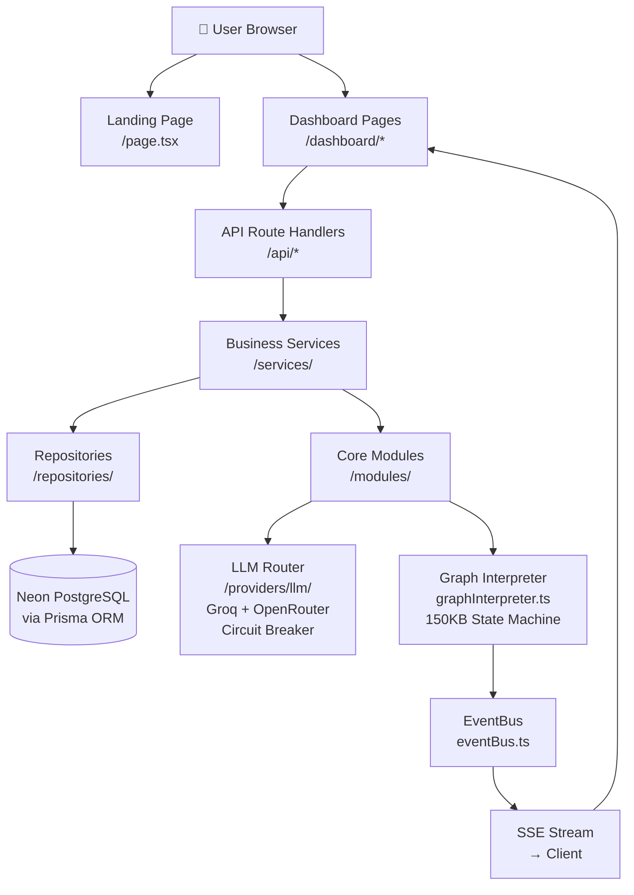

# Agent Hub — Project Structure & File Map

> **Agent Hub** is an enterprise-grade Visual AI Agent & Multi-Agent Orchestration Platform built on **Next.js 16** (App Router + Turbopack), **React 19**, **TypeScript**, **Tailwind CSS v4**, **Prisma/PostgreSQL**, and **Clerk Auth (v7)**. It lets users design complex agent graphs on an interactive canvas, orchestrate multi-step workflows, connect to MCP tool servers, and stream live execution telemetry via SSE.

---

## 🗂️ Root Files

| File | Purpose |
|---|---|
| [`next.config.ts`](file:///c:/Project/Agent%20Hub/next.config.ts) | Next.js 16 configuration (App Router, Turbopack, CSP security headers, server external packages) |
| [`tsconfig.json`](file:///c:/Project/Agent%20Hub/tsconfig.json) | TypeScript strict-mode compiler configuration with path aliases (`@/*`) |
| [`tailwind.config.ts`](file:///c:/Project/Agent%20Hub/tailwind.config.ts) | Tailwind CSS v4 design tokens, VT323 pixel font, and typography extensions |
| [`postcss.config.js`](file:///c:/Project/Agent%20Hub/postcss.config.js) | PostCSS configuration for TailwindCSS |
| [`eslint.config.mjs`](file:///c:/Project/Agent%20Hub/eslint.config.mjs) | ESLint rules (TypeScript + React flat config) |
| [`vitest.config.ts`](file:///c:/Project/Agent%20Hub/vitest.config.ts) | Vitest unit test runner configuration |
| [`playwright.config.ts`](file:///c:/Project/Agent%20Hub/playwright.config.ts) | Playwright E2E test configuration |
| [`.lintstagedrc.json`](file:///c:/Project/Agent%20Hub/.lintstagedrc.json) | lint-staged pre-commit hook rules |
| [`docker-compose.yml`](file:///c:/Project/Agent%20Hub/docker-compose.yml) | Docker Compose for local Postgres + app container |
| [`.env.example`](file:///c:/Project/Agent%20Hub/.env.example) | Template for all required environment variables |
| [`package.json`](file:///c:/Project/Agent%20Hub/package.json) | npm dependencies (Next.js 16.3.4, React 19.2.8, Clerk 7.9.1, Tailwind 4.3.3, Prisma 6.19.3, LangGraph 1.4.14), scripts (`dev`, `dev:webpack`, `build`, `test`, `lint`) |
| [`README.md`](file:///c:/Project/Agent%20Hub/README.md) | Full product documentation, architecture diagrams, quickstart |
| [`CONTRIBUTING.md`](file:///c:/Project/Agent%20Hub/CONTRIBUTING.md) | Contribution guide, PR workflow, code standards |

---

## 🗄️ `prisma/` — Database Layer

| File | Purpose |
|---|---|
| [`schema.prisma`](file:///c:/Project/Agent%20Hub/prisma/schema.prisma) | Full PostgreSQL schema: Skills, Versions, Executions, Approvals, Audit, MCP, OpenAPI, RAG, Org, RBAC tables |
| [`seed.ts`](file:///c:/Project/Agent%20Hub/prisma/seed.ts) | Idempotent demo seed script — populates sample skills, agent graphs, execution traces, audit logs |
| `migrations/` | Auto-generated Prisma migration history |

---

## 📁 `docs/` — Additional Documentation

| File | Purpose |
|---|---|
| [`API.md`](file:///c:/Project/Agent%20Hub/docs/API.md) | Complete REST & SSE API reference documentation |

---

## 📁 `tests/` — Unit Tests

Contains **83 Vitest test suites** with **630+ passing tests** covering all core modules: graph interpreter, expression evaluator, execution engine, tool registry, approval engine, converters, RAG pipeline, MCP protocol, and validators.

---

## 📁 `e2e/` — End-to-End Tests

Playwright E2E smoke tests covering critical user flows (Canvas builder, skill CRUD, execution start, review queue).

---

## 🏗️ `src/` — Application Source

The application follows a **Clean Architecture** pattern with four distinct layers:

```
Presentation  →  API (Route Handlers)  →  Services  →  Repositories / DB
                       ↓
               Core Runtime Modules (graph, execution, tools, RAG, MCP)
                       ↓
               Infrastructure (LLM Providers, Prisma, Clerk, Pino)
```

---

## 🖥️ `src/app/` — Next.js App Router

### Root App Files

| File | Purpose |
|---|---|
| [`layout.tsx`](file:///c:/Project/Agent%20Hub/src/app/layout.tsx) | Root layout: Google Fonts preconnect (`VT323`, `Geist`, `Geist_Mono`), Clerk provider, Theme provider, pitch black viewport theme (`#000000`) |
| [`page.tsx`](file:///c:/Project/Agent%20Hub/src/app/page.tsx) | Public landing page (`VISUAL MULTI-AGENT ORCHESTRATION HUB`) with left-aligned hero, pitch black theme, retro pixel typography, and interactive `LiveAgentCanvasDemo` |
| [`providers.tsx`](file:///c:/Project/Agent%20Hub/src/app/providers.tsx) | Client-side providers: TanStack Query, Zustand, Toaster |
| [`globals.css`](file:///c:/Project/Agent%20Hub/src/app/globals.css) | Global styles: Tailwind CSS v4 (`@import "tailwindcss"; @config "../../tailwind.config.ts";`), VT323 pixel font (`font-pixel`), Geist typography, and pitch black (`#000000`) dark theme system tokens |
| [`loading.tsx`](file:///c:/Project/Agent%20Hub/src/app/loading.tsx) | Root loading skeleton |
| [`not-found.tsx`](file:///c:/Project/Agent%20Hub/src/app/not-found.tsx) | Custom 404 page |
| [`global-error.tsx`](file:///c:/Project/Agent%20Hub/src/app/global-error.tsx) | Top-level error boundary |
| [`proxy.ts`](file:///c:/Project/Agent%20Hub/src/proxy.ts) | Next.js 16 Edge proxy & Clerk Auth middleware — protects `/dashboard/*` and `/api/*` routes with public bypasses for `/api/health` and `/api/mcp/*` |

---

### `src/app/api/` — REST & SSE API Route Handlers (22 groups)

| Route Group | Purpose |
|---|---|
| `skills/` | CRUD (list, get, create, update, delete), publish, archive, duplicate |
| `executions/` | Start, replay, cancel, resume, SSE stream endpoint (`/stream`) |
| `canvas/preview/` | Live canvas ghost preview and SSE streaming for in-editor test runs |
| `approvals/` | HITL review queue listing and idempotent approval/reject/cancel responses |
| `audit/` | Immutable audit trail querying and JSON export |
| `tools/` | Tool catalog listing and health status checks |
| `models/` | Dynamic provider model lists and live token pricing from Groq + OpenRouter |
| `workflows/` | Dify YAML and n8n JSON search and AST conversion endpoints |
| `settings/` | LLM provider status and telemetry configuration |
| `health/` | Public `/api/health` probe (no auth required) |
| `openapi/` | OpenAPI spec parsing, APIs.guru public directory (2500+ APIs), integration management |
| `mcp/` | MCP Server SSE endpoint (`/api/mcp/sse`), MCP client management, 500+ server directory |
| `organizations/` | Org members, roles, invitations, RBAC management |
| `rag/` | RAG collection management, document ingestion, search, evaluation |
| `vault/` | Encrypted secrets CRUD (per-user/per-org credential store) |
| `triggers/` | Webhook creation/management and cron job scheduling |
| `dashboard/` | Dashboard aggregated stats API |
| `compare/` | Side-by-side version diff API |
| `evals/` | Evaluation pipeline run and results API |
| `benchmarks/` | LLM benchmark run and results API |
| `a2a/` | Agent-to-Agent (A2A) protocol endpoints |
| `invitations/` | Org invitation acceptance and management |

---

### `src/app/dashboard/` — Dashboard Pages (14 routes)

| Page | Route | Purpose |
|---|---|---|
| `canvas/` | `/dashboard/canvas` | **Visual Graph Builder** — drag-and-drop node canvas, 14 node types, auto-layout, snapshot, diff |
| `skills/` | `/dashboard/skills` | Skills Registry, CRUD editor, version history, skill marketplace |
| `executions/` | `/dashboard/executions` | Execution history list + trace detail pages (`/[id]`) |
| `review/` | `/dashboard/review` | **HITL Review Queue** — approve/reject/cancel pending execution gates |
| `history/` | `/dashboard/history` | Platform-wide observability, success metrics, usage analytics |
| `compare/` | `/dashboard/compare` | Side-by-side skill/graph version diff viewer |
| `audit/` | `/dashboard/audit` | Immutable security audit trail with JSON export |
| `tools/` | `/dashboard/tools` | Tool Registry Browser + **MCP Hub** (500+ servers) + **OpenAPI Hub** (2500+ APIs) |
| `settings/` | `/dashboard/settings` | Provider models, API keys, live pricing display |
| `workflows/` | `/dashboard/workflows` | Multi-step Workflow Pipelines + Dify/n8n import steppers |
| `a2a/` | `/dashboard/a2a` | Agent-to-Agent delegation management |
| `evals/` | `/dashboard/evals` | Evaluation pipeline configuration and results |
| `benchmarks/` | `/dashboard/benchmarks` | LLM benchmarking runs and leaderboard |
| `knowledge/` | `/dashboard/knowledge` | RAG knowledge base management |

---

## 🧩 `src/components/` — React UI Components (17 groups)

### `canvas/` — Visual Graph Builder Components
| File | Purpose |
|---|---|
| `AgentGraphCanvas.tsx` | Main canvas with fullscreen/normal layouts, pan/zoom, live node highlighting, and `preventScrolling={true}` |
| `MarketplacePanel.tsx` | Drag-and-drop pre-built workflow templates marketplace panel |
| `ConditionalBranchEditor.tsx` | Visual branch editor for Router/Supervisor nodes (deterministic + AI modes) |
| `ConditionExpressionEditor.tsx` | Syntax-highlighted condition expression editor with autocomplete |
| `ExecutionProgressOverlay.tsx` | Real-time floating overlay: progress bar, status grid, HITL details, token summary |
| `ExecutionTimeline.tsx` | Vertical chronological timeline sidebar with search, filter, export (JSON/Markdown) |
| `ParallelBranchProgress.tsx` | Animated parallel branch progress bars with per-branch status chips |
| `GraphDiffModal.tsx` | Visual diff modal with color-coded node/edge cards (green=added, red=removed, amber=changed) |

### Other Component Groups
| Group | Purpose |
|---|---|
| `landing/` | `LiveAgentCanvasDemo.tsx` (interactive playground with cursor-centered wheel zoom, middle-mouse pan, blueprint switcher), `HeroAuthSection.tsx` (Clerk v7 `<Show when="...">` auth gates) |
| `layout/` | `Header.tsx` (pitch black frosted glass header, VT323 bracketed links, Clerk v7 `<Show when="...">` auth buttons), `Sidebar.tsx` (collapsible navigation) |
| `ui/` | `SectionHeader.tsx` (VT323 terminal section headers `// 01.`), `StatTile.tsx` (VT323 retro metric tiles), `Button.tsx`, `Badge.tsx`, `Card.tsx`, `Accordion.tsx` |
| `workflows/` | WorkflowForm, WorkflowCard, WorkflowStepChain, import stepper components |
| `skills/` | SkillForm, StatusBadge, VersionList, skill marketplace components |
| `executions/` | ExecutionTimeline, ExecutionStatusBadge, trace detail components |
| `mcp/` | MCP server browser, connection modals, tool discovery UI |
| `common/` | BrandLogos (exact SVG vectors for OpenRouter & Groq), shared UI primitives |
| `feedback/` | Toaster notifications, ConfirmDialog, Skeleton Library, ErrorBoundary |
| `dashboard/` | Dashboard stats cards, charts, metric panels |
| `organizations/` | Org management UI, member lists, role assignment |
| `vault/` | Secret management UI components |
| `evals/` | Evaluation results display components |
| `benchmarks/` | Benchmark comparison and leaderboard components |
| `effects/` | Background effect animations (particle systems, gradients) |
| `providers/` | Client-side React context providers (SidebarContext, ThemeProvider) |
| [`Reveal.tsx`](file:///c:/Project/Agent%20Hub/src/components/Reveal.tsx) | Intersection Observer scroll-reveal animation wrapper |

---

## ⚙️ `src/modules/` — Core Runtime Modules (15 modules)

### `graph/` — Graph Interpreter Engine
| File | Purpose |
|---|---|
| [`graphInterpreter.ts`](file:///c:/Project/Agent%20Hub/src/modules/graph/graphInterpreter.ts) | **Central state machine** — executes visual graphs node-by-node, handles all 14 node types, typed state transitions, step-level persistence |
| [`expression.ts`](file:///c:/Project/Agent%20Hub/src/modules/graph/expression.ts) | **Safe expression evaluator** — JSONPath queries, logical operators (`==`, `!=`, `>`, `<`, `contains`, `in`), no `eval()` |
| [`eventBus.ts`](file:///c:/Project/Agent%20Hub/src/modules/graph/eventBus.ts) | **Real-time EventBus** — emits lifecycle events (`step_start`, `step_complete`, `tool_call`, `paused_for_approval`) to SSE clients |
| [`previewStore.ts`](file:///c:/Project/Agent%20Hub/src/modules/graph/previewStore.ts) | In-memory ghost dry-run store for canvas preview mode |

### `execution/` — Execution Engine Sub-modules
| Sub-module | Purpose |
|---|---|
| `executor/executionEngine.ts` | Step runner — coordinates graph traversal, dispatches each node to the correct handler |
| `executor/stepReferences.ts` | Resolves `{{ results.<nodeId>.<path> }}` template variable references |
| `executor/cancellation.ts` | Cancellation token system for aborting mid-run executions |
| `executor/retry.ts` | Per-step exponential backoff retry logic |
| `executor/errors.ts` | Typed execution error classes |
| `executor/validation.ts` | Pre-execution node/graph validation |
| `executor/runtime.ts` | Runtime context and execution state helpers |
| `planner/` | LLM-based + rule-based next-step planning |
| `graph/` | Graph traversal utilities and node dependency resolution |
| `llm/` | LLM call handling within execution context |
| `sandbox/` | Isolated V8 JS + Safe Python code execution sandbox |
| `state/` | Typed agent state definition and transitions |
| `tool-registry/` | Runtime tool catalog for the execution engine |

### `approval/` — HITL Approval Engine
Approval policy rules, idempotency validators, and auto-approval condition evaluation.

### `mcp/` — Model Context Protocol Ecosystem
| File | Purpose |
|---|---|
| `connection.ts` | SSE + stdio MCP server connection management |
| `protocol.ts` | MCP JSON-RPC protocol implementation |
| `server.ts` | **Agent Hub as an MCP Server** — exposes published skills as callable tools via `/api/mcp/sse` |
| `toolAdapter.ts` | Adapts discovered MCP tools into the internal `ITool` interface |
| `toolDiff.ts` | Detects schema changes between MCP tool versions |
| `presets.ts` | 1-click preset configs (GitHub, Postgres, SQLite, Brave Search, etc.) |
| `circuitBreaker.ts` | Circuit-breaker for MCP connection failures |
| `sessionStore.ts` | Per-client MCP session management |

### `rag/` — Retrieval-Augmented Generation Pipeline
| File | Purpose |
|---|---|
| `multiModalProcessor.ts` | Extracts tables (MD/CSV), code blocks (language detection), and images from documents |
| `knowledgeGraph.ts` | Pattern NER for 8 entity types, co-occurrence relationships, community detection, BFS traversal |
| `chunkOptimizer.ts` | Statistical chunk size analysis, F1-score boundary detection, quality scoring |
| `crossCollectionSearch.ts` | Federated search across multiple RAG collections with MMR diversity re-ranking |
| `ragEvalPipeline.ts` | Full evaluation suite: Context Precision/Recall, Faithfulness, Hallucination Detection, Precision@k, MRR |
| `chunkingService.ts` | Text chunking with overlapping window strategies |
| `embeddingService.ts` | Vector embedding generation and batching |
| `pgvectorStore.ts` | pgvector storage, hybrid dense+sparse search, HNSW index management |
| `reranker.ts` | Cross-encoder reranking for retrieved chunks |
| `clusterVisualizer.ts` | t-SNE/UMAP cluster visualization data generation |
| `evaluation.ts` | RAG Triad evaluation (context, faithfulness, relevance) |
| `fileParsers.ts` | PDF, Markdown, HTML, and plain text file parsing |
| `index.ts` | RAG pipeline orchestrator — main entry point |

### `tools/` — Built-in Tool Registry (8 tools)
| Tool | Category | Approval? | Purpose |
|---|---|---|---|
| `calculator/` | COMPUTE | No | Safe math expression evaluation |
| `document-search/` | SEARCH | No | Keyword + semantic search over knowledge base |
| `record-lookup/` | DATA | No | Structured CRM/entity record retrieval |
| `ai-extraction/` | AI | No | LLM-powered structured parameter extraction |
| `ai-classification/` | AI | No | Intent and risk category classification |
| `deterministic-condition/` | LOGIC | No | Threshold and rule verification |
| `final-report/` | SYNTHESIS | No | Executive summary report compilation |
| `mock-task/` | TASK | **Yes** | Write action dispatcher requiring HITL signoff |

Other files: `registry/` (runtime tool catalog), `interfaces/` (ITool contract), `toolCatalog.ts`, `validators/`, `categories.ts`, `builtins.ts`

### Other Modules
| Module | Purpose |
|---|---|
| `audit/` | Audit log recording and querying |
| `history/` | ExecutionHistoryService — aggregated metrics and pagination |
| `openapi/` | OpenAPI spec parser, endpoint adapter, presets, validator |
| `comparison/` | Version comparison and diff utilities |
| `evals/` | Custom evaluation pipeline runner |
| `benchmarks/` | LLM benchmarking harness |
| `observability/` | Metrics collection and telemetry aggregation |
| `timeline/` | Execution event timeline structuring |
| `a2a/` | Agent-to-Agent delegation protocol |

---

## 🔌 `src/services/` — Business Logic Services (17 services)

| Service | Purpose |
|---|---|
| [`ExecutionService.ts`](file:///c:/Project/Agent%20Hub/src/services/ExecutionService.ts) | Orchestrates full execution lifecycle: start, replay, cancel, resume; bridges API ↔ Graph Interpreter |
| [`SkillService.ts`](file:///c:/Project/Agent%20Hub/src/services/SkillService.ts) | Skill CRUD, draft branching, version management |
| [`ApprovalService.ts`](file:///c:/Project/Agent%20Hub/src/services/ApprovalService.ts) | HITL approval queue management with idempotency guarantees |
| [`AuditService.ts`](file:///c:/Project/Agent%20Hub/src/services/AuditService.ts) | Immutable audit log writes and exports |
| [`RBACService.ts`](file:///c:/Project/Agent%20Hub/src/services/RBACService.ts) | Role-Based Access Control — custom roles, permission checks, org-scoped enforcement |
| [`OrganizationService.ts`](file:///c:/Project/Agent%20Hub/src/services/OrganizationService.ts) | Multi-tenancy: org CRUD, member management, plan enforcement |
| [`McpClientService.ts`](file:///c:/Project/Agent%20Hub/src/services/McpClientService.ts) | MCP client lifecycle: connect, discover tools (`tools/list`), execute, disconnect |
| [`OpenApiService.ts`](file:///c:/Project/Agent%20Hub/src/services/OpenApiService.ts) | OpenAPI spec parsing, endpoint introspection, integration registration |
| [`TriggerService.ts`](file:///c:/Project/Agent%20Hub/src/services/TriggerService.ts) | Inbound webhook management (HMAC-SHA256 verification), cron job scheduling |
| [`VaultService.ts`](file:///c:/Project/Agent%20Hub/src/services/VaultService.ts) | Encrypted secrets store (AES-256) with per-user/per-org scoping |
| [`MemoryService.ts`](file:///c:/Project/Agent%20Hub/src/services/MemoryService.ts) | Persistent agent memory (episodic + semantic) with tag-based retrieval |
| [`DashboardStatsService.ts`](file:///c:/Project/Agent%20Hub/src/services/DashboardStatsService.ts) | Aggregated platform-wide usage metrics for dashboard overview |
| [`PlanLimitsService.ts`](file:///c:/Project/Agent%20Hub/src/services/PlanLimitsService.ts) | Subscription plan enforcement (skill limits, execution quotas, feature gating) |
| [`CustomRoleService.ts`](file:///c:/Project/Agent%20Hub/src/services/CustomRoleService.ts) | Custom org-scoped RBAC role definition and permission management |
| [`ApiKeyService.ts`](file:///c:/Project/Agent%20Hub/src/services/ApiKeyService.ts) | API key generation, hashing, validation for programmatic access |
| [`InvitationEmailService.ts`](file:///c:/Project/Agent%20Hub/src/services/InvitationEmailService.ts) | Org invitation email dispatch |
| [`A2AClientService.ts`](file:///c:/Project/Agent%20Hub/src/services/A2AClientService.ts) | Agent-to-Agent delegation protocol client |

---

## 🗃️ `src/repositories/` — Data Access Layer (Prisma Repositories)

| Repository | Purpose |
|---|---|
| [`SkillRepository.ts`](file:///c:/Project/Agent%20Hub/src/repositories/SkillRepository.ts) | Skill + Version CRUD queries with Prisma |
| [`ExecutionRepository.ts`](file:///c:/Project/Agent%20Hub/src/repositories/ExecutionRepository.ts) | Execution record persistence and trace retrieval |
| [`ApprovalRepository.ts`](file:///c:/Project/Agent%20Hub/src/repositories/ApprovalRepository.ts) | Approval request storage and status updates |
| [`ApprovalHistoryRepository.ts`](file:///c:/Project/Agent%20Hub/src/repositories/ApprovalHistoryRepository.ts) | Historical approval decision storage |
| [`AuditLogRepository.ts`](file:///c:/Project/Agent%20Hub/src/repositories/AuditLogRepository.ts) | Immutable audit entry writes |
| [`ExecutionLogRepository.ts`](file:///c:/Project/Agent%20Hub/src/repositories/ExecutionLogRepository.ts) | Step-level execution log storage |
| [`McpServerRepository.ts`](file:///c:/Project/Agent%20Hub/src/repositories/McpServerRepository.ts) | MCP server config persistence |
| [`OpenApiRepository.ts`](file:///c:/Project/Agent%20Hub/src/repositories/OpenApiRepository.ts) | OpenAPI integration and endpoint config storage |
| [`ToolDefinitionRepository.ts`](file:///c:/Project/Agent%20Hub/src/repositories/ToolDefinitionRepository.ts) | Custom tool definition persistence |
| `interfaces/` | Dependency inversion interfaces for all repositories |

---

## 🤖 `src/providers/llm/` — LLM Provider Layer

| File | Purpose |
|---|---|
| [`LLMProvider.ts`](file:///c:/Project/Agent%20Hub/src/providers/llm/LLMProvider.ts) | Abstract `ILLMProvider` interface — unified completion, streaming, embedding contract |
| [`GroqProvider.ts`](file:///c:/Project/Agent%20Hub/src/providers/llm/GroqProvider.ts) | Groq SDK implementation (ultra-fast inference) |
| [`OpenRouterProvider.ts`](file:///c:/Project/Agent%20Hub/src/providers/llm/OpenRouterProvider.ts) | OpenRouter multi-model gateway implementation |
| [`CustomOpenAICompatibleProvider.ts`](file:///c:/Project/Agent%20Hub/src/providers/llm/CustomOpenAICompatibleProvider.ts) | Generic OpenAI-compatible endpoint provider |
| [`LLMRouter.ts`](file:///c:/Project/Agent%20Hub/src/providers/llm/LLMRouter.ts) | **Circuit-breaker resilient router** — failover across providers on 429/5xx/404, adaptive cooldowns |
| [`modelProviderService.ts`](file:///c:/Project/Agent%20Hub/src/providers/llm/modelProviderService.ts) | Live model catalog fetching with real-time token pricing from Groq + OpenRouter |
| [`modelLists.ts`](file:///c:/Project/Agent%20Hub/src/providers/llm/modelLists.ts) | Static fallback model lists with capabilities and pricing metadata |
| [`http.ts`](file:///c:/Project/Agent%20Hub/src/providers/llm/http.ts) | HTTP client with retry, timeout, and streaming support |
| [`structuredOutput.ts`](file:///c:/Project/Agent%20Hub/src/providers/llm/structuredOutput.ts) | JSON-mode structured output parsing and validation |
| [`index.ts`](file:///c:/Project/Agent%20Hub/src/providers/llm/index.ts) | Provider registry and router factory export |

---

## 📐 `src/lib/` — Shared Utilities & Infrastructure

| File/Directory | Purpose |
|---|---|
| `converters/dify-converter.ts` | **Dify YAML AST Converter** — maps Dify workflow nodes to studio graph nodes |
| `converters/n8n-converter.ts` | **n8n JSON AST Converter** — maps n8n workflow JSON to studio graph nodes |
| `config/env.ts` | Zod-validated environment variable schema with Vercel URL auto-detection and quote normalization |
| `logger/` | Pino structured JSON logger setup with log levels and context |
| `utils/pricing.ts` | Dynamic token pricing calculation & formatting utilities |
| `api/` | Shared API client helpers and fetch wrappers |
| `catalogs/` | Static data catalogs (e.g. tool categories, node type metadata, MCP directories) |
| `execution/` | Shared execution utility types |
| `vault/` | Vault encryption helpers |
| `secrets.ts` | Secret resolution utilities (resolves vault references in tool configs) |
| `prisma.ts` | Prisma client singleton with connection pooling |
| `prisma-helpers.ts` | Common Prisma query patterns and error normalizers |
| `fetch-utils.ts` | Server-side fetch with auth headers and error handling |
| `tools.ts` | Tool config helpers |
| `user.ts` | Clerk user context extraction utilities |

---

## 📋 `src/validators/` — Zod Request Validators

| File | Purpose |
|---|---|
| [`graphSchema.ts`](file:///c:/Project/Agent%20Hub/src/validators/graphSchema.ts) | Full Zod schema for graph node types, edges, and graph structure |
| [`skillSchema.ts`](file:///c:/Project/Agent%20Hub/src/validators/skillSchema.ts) | Skill create/update/publish request validation |
| [`executionSchema.ts`](file:///c:/Project/Agent%20Hub/src/validators/executionSchema.ts) | Execution start and replay request validation |
| [`approvalSchema.ts`](file:///c:/Project/Agent%20Hub/src/validators/approvalSchema.ts) | Approval response payload validation |
| [`mcpSchema.ts`](file:///c:/Project/Agent%20Hub/src/validators/mcpSchema.ts) | MCP server registration and tool call validation |
| [`openApiSchema.ts`](file:///c:/Project/Agent%20Hub/src/validators/openApiSchema.ts) | OpenAPI spec import and endpoint config validation |
| [`a2aSchema.ts`](file:///c:/Project/Agent%20Hub/src/validators/a2aSchema.ts) | Agent-to-Agent delegation request validation |

---

## 📦 `src/types/` — TypeScript Type Definitions (17 files)

| File | Purpose |
|---|---|
| [`graph.ts`](file:///c:/Project/Agent%20Hub/src/types/graph.ts) | All graph node type interfaces (14 node types), edge types, canvas state |
| [`skill.ts`](file:///c:/Project/Agent%20Hub/src/types/skill.ts) | Skill, SkillVersion, SkillStatus types |
| [`execution.ts`](file:///c:/Project/Agent%20Hub/src/types/execution.ts) | ExecutionRecord, ExecutionEvent, StepResult types |
| [`mcp.ts`](file:///c:/Project/Agent%20Hub/src/types/mcp.ts) | MCP server config, tool definition, session types |
| [`mcp-directory.ts`](file:///c:/Project/Agent%20Hub/src/types/mcp-directory.ts) | MCP public directory server listing types |
| [`openapi.ts`](file:///c:/Project/Agent%20Hub/src/types/openapi.ts) | OpenAPI integration, endpoint, and spec types |
| [`approval.ts`](file:///c:/Project/Agent%20Hub/src/types/approval.ts) | ApprovalRequest, ApprovalResponse, form field types |
| [`dashboard.ts`](file:///c:/Project/Agent%20Hub/src/types/dashboard.ts) | Dashboard stats and chart data types |
| [`settings.ts`](file:///c:/Project/Agent%20Hub/src/types/settings.ts) | Provider settings and configuration types |
| [`tool.ts`](file:///c:/Project/Agent%20Hub/src/types/tool.ts) | ITool interface and tool category enum |
| [`a2a.ts`](file:///c:/Project/Agent%20Hub/src/types/a2a.ts) | Agent-to-Agent protocol types |
| [`evals.ts`](file:///c:/Project/Agent%20Hub/src/types/evals.ts) | Evaluation run and metric types |
| [`benchmark.ts`](file:///c:/Project/Agent%20Hub/src/types/benchmark.ts) | Benchmark run, result, and leaderboard types |
| [`observability.ts`](file:///c:/Project/Agent%20Hub/src/types/observability.ts) | Observability metric and telemetry types |
| [`skillPacks.ts`](file:///c:/Project/Agent%20Hub/src/types/skillPacks.ts) | Skill pack marketplace listing types |
| [`agent-studio-registry.ts`](file:///c:/Project/Agent%20Hub/src/types/agent-studio-registry.ts) | Global type registry for tool + node catalogs |
| [`declarations.d.ts`](file:///c:/Project/Agent%20Hub/src/types/declarations.d.ts) | Module declaration overrides (e.g. untyped npm packages) |

---

## 🪝 `src/hooks/` — Custom React Hooks

| File | Purpose |
|---|---|
| [`useModels.ts`](file:///c:/Project/Agent%20Hub/src/hooks/useModels.ts) | TanStack Query hook for fetching live model list with pricing |
| [`usePermissions.ts`](file:///c:/Project/Agent%20Hub/src/hooks/usePermissions.ts) | RBAC permission check hook (reads Clerk org + custom role context) |

---

## 🗂️ `src/stores/` — Global Client State (Zustand)

| File | Purpose |
|---|---|
| [`toastStore.ts`](file:///c:/Project/Agent%20Hub/src/stores/toastStore.ts) | Global toast notification queue (Zustand store) |

---

## 🧭 Architecture Overview



---

## 🔑 Key Architectural Decisions

| Decision | Detail |
|---|---|
| **Next.js 16 + Turbopack** | App Router powered by Next.js 16 with high-speed Turbopack compilation and dev server |
| **Clean Architecture** | Strict separation: API → Services → Repositories → DB, no cross-layer leakage |
| **Dependency Inversion** | All repositories and services have interface contracts in `interfaces/` sub-folders |
| **SSE for real-time** | Native Web Streams API used for execution telemetry, no WebSocket dependency |
| **Zod everywhere** | All API inputs, env vars, and graph schemas validated with Zod |
| **Immutable versioning** | Published skill versions are frozen; edits create new draft branches |
| **Circuit-breaker LLM** | LLMRouter auto-fails over between Groq → OpenRouter on errors with adaptive cooldowns |
| **No `eval()`** | Expression evaluator uses safe AST-based parsing (no eval, no exec) |
| **MCP dual-role** | App is both an MCP *Client* (consuming external servers) and an MCP *Server* (exposing skills) |
| **Pitch Black UI & Dual Typography** | Pure pitch-black (`#000000`) dark theme paired with VT323 pixel font and Geist sans readability |
| **Isolated Canvas Scrolling** | Canvas mouse wheel zoom is non-passive and cursor-centered with zero parent page scroll chaining |
